# CURSO: CC451

## Laboratorio Dirigido 01

## 1. Introducción

**Objetivo general:**

Introducción al prototipado de aplicaciones para dispositivos móviles.
En este laboratorio crearemos el prototipo de una aplicación móvil con un esquema de interacción simple.

## 2. Recursos Informáticos

1. FIGMA web site: <https://www.figma.com/>
2. FIGMA Channel: <https://www.youtube.com/channel/UCQsVmhSa4X-G3lHlUtejzLA>
3. FIGMA Curso para principiantes: <https://www.youtube.com/watch?v=zzhSFobLkYw&list=PLXDU_eVOJTx5IuSrbtanZHnDuPB3Hx0hq&index=1>
4. FIGMA Diseño de Figma para principiantes: <https://www.youtube.com/watch?v=zt-Zr57Vfzs&list=PLXDU_eVOJTx5IuSrbtanZHnDuPB3Hx0hq&index=4>

## 3. DESARROLLO

Al final entregara un archivo con el nombre **CC451_Lab01_<Nombre_apellido>.zip** con los archivos generados por usted en el laboratorio. Los Prototipos Escogidos de modelos en papel, deben ser reproducidos en la herramienta FIGMA.

## 4. Ejercicio

**Tarea:** realizar un prototipo de una aplicación móvil para implementar una de las aplicaciones propuestas en el anexo.

*(Ej: Fig.1)*
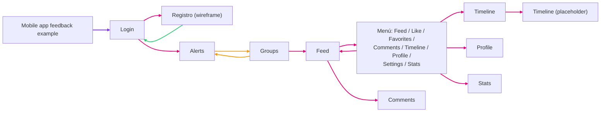
Para ello:

### 4.1. Diseño inicial de un wireframe

*(tiempo: 30 min)*

1. Escoja y anote el tema a desarrollar del anexo. A partir de la funcionalidad definida, agregue los detalles y funcionalidad necesarias para que la aplicación sea util y funcional. Describa por lo menos 10 tareas o funciones que deberán implementarse

*(funciones: p. ej. autenticación y registro de usuarios, inscripción de mascotas, catalogo de artículos, descripción de los servicios, interacción con otros usuarios, etc.)*

Crear un Archivo (**CC451_Lab01_<Nombre_apellido>.doc**) con sus respuestas.

2. Diseñar por lo menos 8-10 pantallas (30 min) y un esquema adicional de interacciones entre ellas. (Debe ser un wireframe en papel) Deberá adjuntar las fotos de su diseño a su documento.

### 4.2. Definir un Grupo temporal de 1-2 personas para discutir su diseño con su compañero de grupo

*(tiempo: 30 min.)*

3.1. Registre las ideas adicionales que surgen de la discusión.

### 4.3. Actualice su diseño con las sugerencias aceptadas

*(tiempo: 1:30 hrs.)*

Actualice su diseño y esquema de interacciones, a un diseño "En Limpio", utilizando FIGMA.

Ver: <https://www.youtube.com/watch?v=zt-Zr57Vfzs&list=PLXDU_eVOJTx5IuSrbtanZHnDuPB3Hx0hq&index=4>

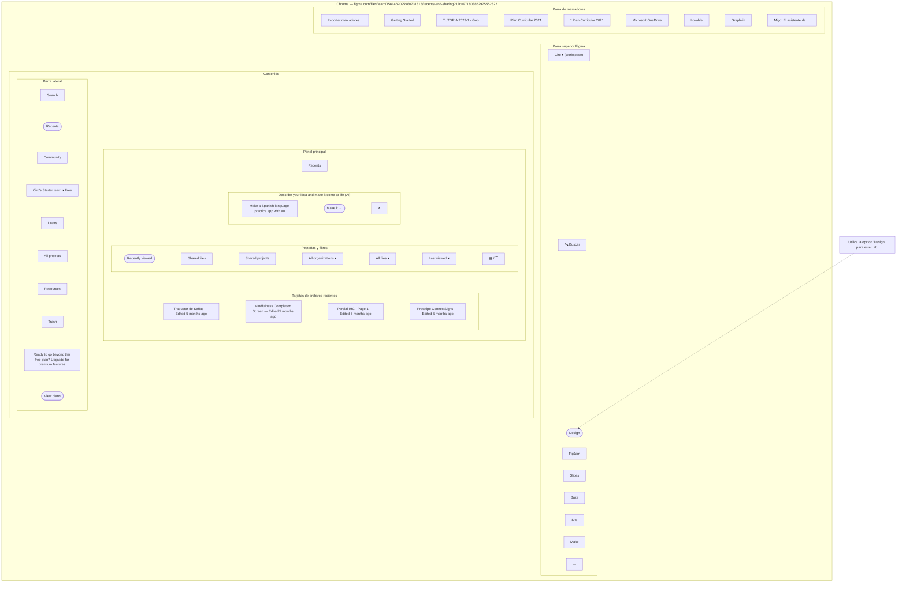
### 4.4. Compartir su diseño

Cree un archivo DOC. Individual

1. Incluya tareas definidas
2. Incluya Wireframes de baja fidelidad que usted ha diseñado en papel.
3. Comente su Diseño justifique las decisiones. Indique cuales fueron las sugerencias aceptadas y por que.
4. Indique y justifique cuales fueron sus sugerencias al diseño de su compañero de grupo.
5. Muestre las Pantallas generadas y modificadas con FIGMA
6. Describa el proceso los pasos que utilizo para crear el prototipo final
7. Incluya el enlace para acceder al prototipo.
8. Comprima los archivos resultantes y suba el archivo comprimido (**CC451_Lab01_<Nombre_apellido>.zip**) al repositorio del curso en **MS Teams**

---

Ver: https://www.youtube.com/watch?v=zt-Zr57Vfzs&list=PLXDU_eVOJTx5IuSrbtanZHnDuPB3Hx0hq&index=4

a) Cree una cuenta en https://www.figma.com/ y cree un archivo Nuevo

*Fig 2.1 Crear Nuevo archivo de diseño*
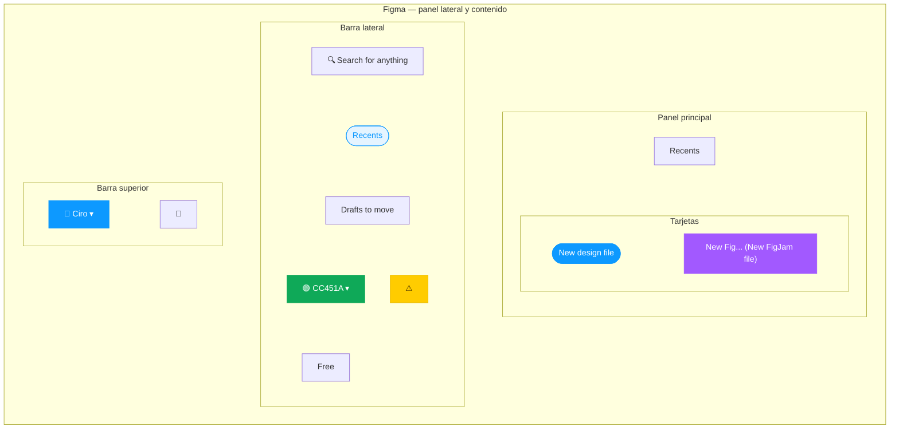
para que aparezca el panel de la Fig 2.2

*Fig 2.2: Panel de FIGMA.*

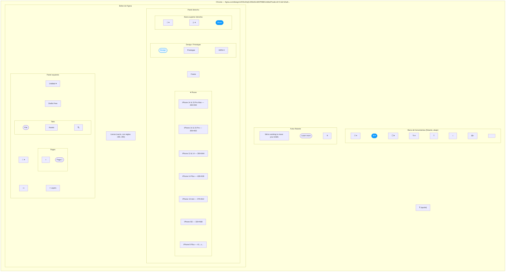

b) En una página puede insertar varios paneles ▦ que representarán las pantallas de su aplicación (Fig.3) por ejemplo pueden ser paneles tipo "Android compact" (Fig.4).
 
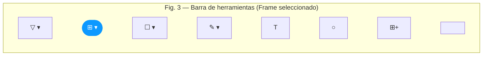
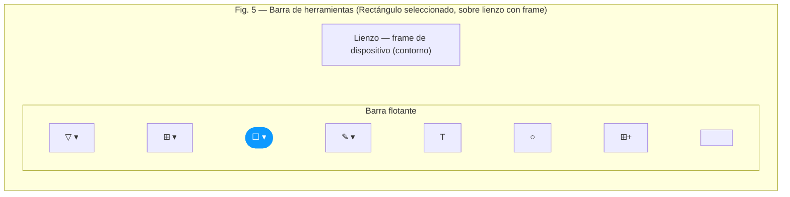
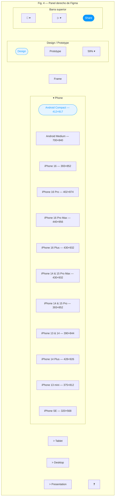

Buscamos Librerias de componentes: en back la barra de herramientas: ⊞

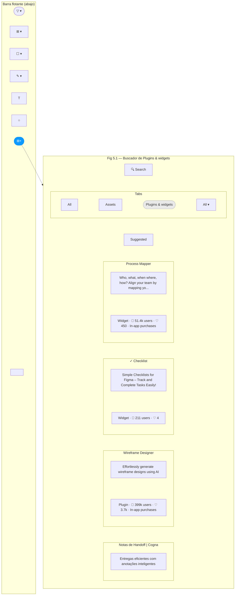

en el campo de búsqueda podemos buscar en la sección Plugins & widgets

c) **En cada panel** puede agregar los componentes que crea necesarios (Fig. 5). Puede encontrar componentes en diseños compartidos por la comunidad de figma.

P.ej. Puede buscar p. ej. Ink Wireframe. En la pantalla desplegada (Fig. 5.2) encontrará componentes (p. Ej. Device) que puede agregar a su panel

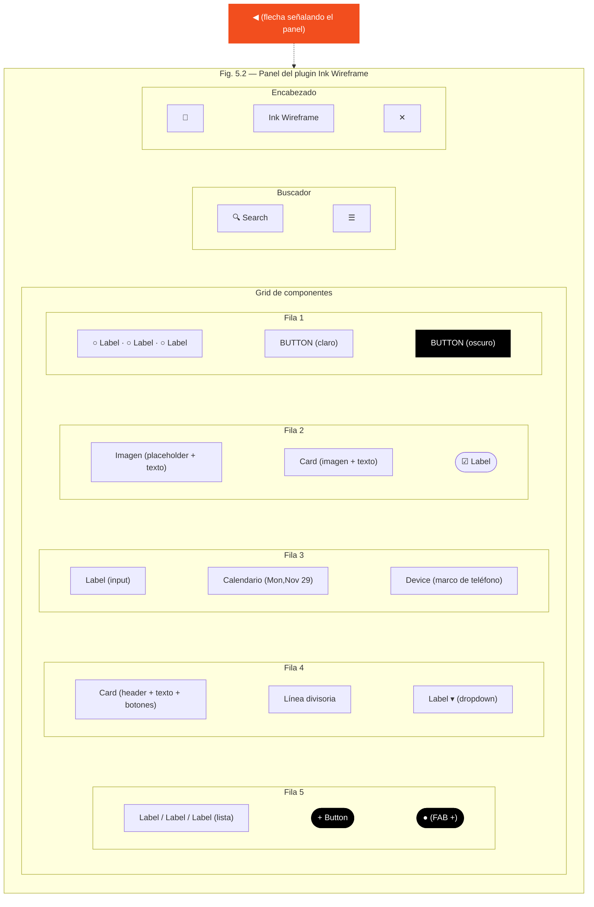

El resultado de agregar device al panel se ve en la fig. 5.3

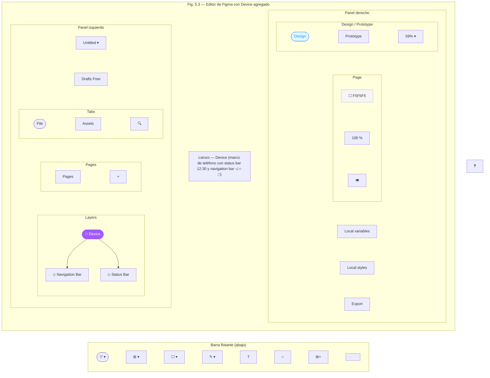

d) Las interacciones (transiciones) entre componentes y pantallas se pueden definir en el panel derecho, en el TAB "PROTOTYPE". Para que se pueda modelar las interacciones **los componentes siempre deben estar dentro de un panel.** (Fig.6)

```mermaid
flowchart TB
    subgraph fig6["Fig. 6 — Insertando interacciones"]
        direction LR

        subgraph browser6["Chrome — figma.com/design/QWNosP04x5MaUnPHvZmizO/Untitled?node-id=0-1..."]
            direction LR

            subgraph leftpanel6["Panel izquierdo"]
                direction TB
                filename6["Untitled ▾"]
                filestatus6["Drafts   Free"]
                subgraph filetabs6["Tabs"]
                    direction LR
                    ft6_1(["File"])
                    ft6_2["Assets"]
                    ft6_search["🔍"]
                    ft6_1 ~~~ ft6_2 ~~~ ft6_search
                end
                subgraph pages6["Pages"]
                    direction LR
                    pages6_label["Pages"]
                    pages6_add["+"]
                    pages6_label ~~~ pages6_add
                end
                page6_1(["Page 1"])
                subgraph layers6["Layers"]
                    direction TB
                    ly_cardsmall["◇ Card - Small"]
                    ly_frame1["  Frame"]
                    ly_frame2["  Frame"]
                    ly_cardlarge["◇ Card - Large"]
                    ly_image["  Image"]
                    ly_vector["    Vector"]
                    ly_base["    Base"]
                    ly_frame3["  Frame"]
                    ly_frame4["  Frame"]
                    ly_frame5["  Frame"]
                    ly_btnsmall1["    ◇ Button - Small"]
                    ly_frame6["      Frame"]
                    ly_minwidth["      Min Width 64"]
                    ly_btnsmall2["    ◇ Button - Small"]
                    ly_device["◇ Device"]
                    ly_navbar["  Navigation Bar"]
                    ly_statusbar["  Status Bar"]
                    ly_cardsmall --> ly_frame1
                    ly_cardsmall --> ly_frame2
                    ly_cardlarge --> ly_image --> ly_vector
                    ly_image --> ly_base
                    ly_cardlarge --> ly_frame3
                    ly_cardlarge --> ly_frame4
                    ly_cardlarge --> ly_frame5
                    ly_frame5 --> ly_btnsmall1 --> ly_frame6
                    ly_btnsmall1 --> ly_minwidth
                    ly_frame5 --> ly_btnsmall2
                    ly_device --> ly_navbar
                    ly_device --> ly_statusbar
                end
                filename6 ~~~ filestatus6 ~~~ filetabs6 ~~~ pages6 ~~~ page6_1 ~~~ layers6
            end

            subgraph canvas6["Lienzo — dos frames Android Compact"]
                direction LR
                subgraph frameA["Frame A — 'Title' (Card grande)"]
                    direction TB
                    fa_status["12:30                ▼◀▮"]
                    fa_title["✕  Title        ↺ ↻ ⋮"]
                    subgraph fa_card1["Card"]
                        direction TB
                        fa_icon["☁ (icono)"]
                        fa_cardtitle["Title / Subtitle"]
                        fa_desc["Supporting or descriptive text for the card goes here like a pro."]
                        fa_btns["BUTTON   BUTTON ⏺"]
                        fa_icon ~~~ fa_cardtitle ~~~ fa_desc ~~~ fa_btns
                    end
                    subgraph fa_card2["Overline card"]
                        direction TB
                        fa2_over["OVERLINE"]
                        fa2_title["Title"]
                        fa2_desc["Supporting or descriptive text for the card goes here."]
                        fa2_icon["☁ (icono)"]
                        fa2_btns["BUTTON   BUTTON"]
                        fa2_over ~~~ fa2_title ~~~ fa2_desc ~~~ fa2_icon ~~~ fa2_btns
                    end
                    fa_nav["◁  ○  □"]
                    fa_status ~~~ fa_title ~~~ fa_card1 ~~~ fa_card2 ~~~ fa_nav
                end

                subgraph frameB["Frame B — 'Title' (Video + placeholder)"]
                    direction TB
                    fb_status["12:30                ▼◀▮"]
                    fb_title["✕  Title        ↺ ↻ ⋮"]
                    fb_video["▷ (reproductor de video)"]
                    fb_placeholder["☒ (placeholder de imagen)"]
                    fb_btns["BUTTON   BUTTON"]
                    fb_nav["◁  ○  □"]
                    fb_status ~~~ fb_title ~~~ fb_video ~~~ fb_placeholder ~~~ fb_btns ~~~ fb_nav
                end

                flowlabel(["Flow 1 ⧉"])
                frameA -- "interacción (Flow 1)" --> frameB
                flowlabel -.-> frameA
            end

            subgraph rightpanel6["Panel derecho"]
                direction TB
                subgraph rp6_top["Barra superior"]
                    direction LR
                    rp6_user["🔵 ▾"]
                    rp6_play["▷ ▾"]
                    rp6_share(["Share"])
                    rp6_user ~~~ rp6_play ~~~ rp6_share
                end
                subgraph rp6_tabs["Design / Prototype"]
                    direction LR
                    rp6_design["Design"]
                    rp6_proto(["Prototype"])
                    rp6_zoom["59% ▾"]
                    rp6_design ~~~ rp6_proto ~~~ rp6_zoom
                end
                rp6_settingslabel["Prototype settings"]
                rp6_device["Android Compact ▾"]
                subgraph rp6_bgrow["Fondo"]
                    direction LR
                    rp6_black["Black ▾"]
                    rp6_orient1["▯"]
                    rp6_orient2["▭"]
                    rp6_black ~~~ rp6_orient1 ~~~ rp6_orient2
                end
                rp6_color["■ 000000"]
                rp6_preview["(vista previa negra con marco de teléfono)"]
                rp6_flowslabel["Flows"]
                rp6_flow1["Flow 1"]
                subgraph rp6_note1["Removing a connection ✕"]
                    direction TB
                    rp6_note1_text["⌐× To delete a connection, click and drag on either end."]
                end
                subgraph rp6_note2["Running your prototype ✕"]
                    direction TB
                    rp6_note2_text["▷ Use the play button in the toolbar to play your prototype. If there are no connections, the play button can be used to play a presentation of your frames."]
                end
                rp6_top ~~~ rp6_tabs ~~~ rp6_settingslabel ~~~ rp6_device ~~~ rp6_bgrow ~~~ rp6_color ~~~ rp6_preview ~~~ rp6_flowslabel ~~~ rp6_flow1 ~~~ rp6_note1 ~~~ rp6_note2
            end

            leftpanel6 ~~~ canvas6 ~~~ rightpanel6
        end

        subgraph toolbar6["Barra flotante (abajo)"]
            direction LR
            t6_move(["▽ ▾"])
            t6_frame["⊞ ▾"]
            t6_rect["☐ ▾"]
            t6_pen["✎ ▾"]
            t6_text["T"]
            t6_ellipse["○"]
            t6_comp["⊞+"]
            t6_code["</>"]
            t6_move ~~~ t6_frame ~~~ t6_rect ~~~ t6_pen ~~~ t6_text ~~~ t6_ellipse ~~~ t6_comp ~~~ t6_code
        end

        help6["❓"]

        browser6 ~~~ toolbar6
    end

    classDef figblue fill:#0D99FF,stroke:#0D99FF,color:#ffffff
    classDef figbluelt fill:#E5F4FF,stroke:#0D99FF,color:#0D99FF
    classDef figpurple fill:#A259FF,stroke:#A259FF,color:#ffffff
    classDef figblack fill:#000000,stroke:#000000,color:#ffffff
    class rp6_share figblue
    class rp6_proto figbluelt
    class flowlabel figbluelt
    class rp6_color figblack
    class rp6_preview figblack
    class ly_cardsmall figpurple
    class ly_cardlarge figpurple
    class ly_device figpurple
    class fa_btns figblack
    class fa2_btns figblack
    class fb_btns figblack
```

Luego puede simular las interacciones con el boton **play**

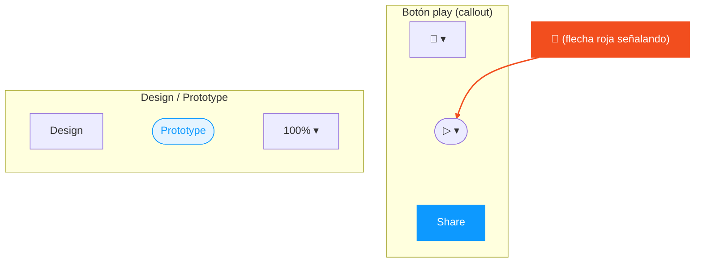

E) Incorpore el texto necesario para cada pantalla donde se indique su propósito. Y otro texto de ayuda. Incluya un texto con su nombre, el titulo de su aplicacion, el Nombre del curso y Numero de Laboratorio.

---

## ANEXO: Temas sugeridos

### 1. Educación Inicial (3 a 6 años)

*Aplicaciones móviles con interfaces táctiles grandes, feedback visual/auditivo y modos para padres/educadores.*

| Aplicación | Funcionalidad Principal | Características de Pantallas (UI/UX Móvil) |
|---|---|---|
| a) "Mi Primer Diario" | Registro emocional diario mediante selección de caras y dibujo libre. | Pantalla principal con calendario visual. Cada día, el niño elige entre 5 emociones representadas por monstruos de colores. Pantalla de dibujo con trazo simple (dedo) que se guarda en una galería. Modo padres con resumen semanal de tendencias emocionales. |
| b) "Rutinas que Juegan" | Recordatorio interactivo de rutinas (lavarse los dientes, vestirse) usando historias cortas. | Pantalla de "aventura del día" con personaje que guía pasos. Botones gigantes para "comenzar" y "terminar". Cada rutina completada desbloquea una pegatina en un álbum. Notificaciones push suaves (con sonidos amigables) solo en horarios configurables por el adulto. |
| c) "Trazo Mágico" | Aprendizaje de grafomotricidad y letras con seguimiento del dedo. | Pantalla a pantalla completa sin bordes; el niño repasa formas y letras con el dedo. Feedback visual: el trazo se ilumina de verde si sigue el camino. Pantalla de resultados con estrellas y opción de repetir. Sección de progreso para adultos con métricas de precisión. |
| d) "Sonidos Escondidos" | Juego de memoria auditiva y asociación objeto-sonido. | Parrilla de tarjetas con dibujos. Al tocar cada tarjeta, suena un sonido (animal, instrumento). Pantalla de parejas: deben emparejar sonido con imagen. Interfaz sin texto, solo iconos grandes y coloridos. Control parental para ajustar dificultad. |
| e) "Cuéntame un Cuento" | Creación colaborativa de cuentos con grabación de voz del adulto y del niño. | Pantalla de creación: el adulto graba una página (voz) y el niño elige stickers para ilustrar. Luego se reproduce como un "cuento animado" con las voces grabadas. Biblioteca de cuentos en pantalla principal. Modo noche con fondo oscuro y sonidos relajantes. |

### 2. Medicina Veterinaria

*Apps móviles para dueños de mascotas, profesionales y estudiantes, con énfasis en gestión, telemedicina básica y educación.*

| Aplicación | Funcionalidad Principal | Características de Pantallas (UI/UX Móvil) |
|---|---|---|
| a) "VetAssistant" | Guía de primeros auxilios y síntomas por reconocimiento visual. | Pantalla de inicio con selector de especie (perro/gato/conejo). Cámara integrada para tomar foto de síntoma (herida, ojo irritado) y devolver sugerencias de cuidado. Pantalla de resultados con lista de pasos a seguir y botón de "llamar al vet" con ubicación de clínicas cercanas. |
| b) "Dosis Justa" | Calculadora de medicamentos y recordatorio de tratamientos. | Pantalla de perfil de mascota (peso, edad, condición). Al escanear el envase del medicamento (código de barras), calcula dosis automáticamente. Calendario interactivo con alarmas programadas. Pantalla de historial de tratamientos con gráfico de cumplimiento. |
| c) "Mi Mascota al Día" | Registro de hábitos (alimentación, ejercicio, síntomas) con análisis simple. | Pantalla tipo "feed" donde se registran eventos con un toque (comió, bebió, hizo popó, vomitó). Vista de calendario y gráficos de barras simples. Pantalla de resumen semanal para compartir con el veterinario vía PDF. Notificaciones para recordar vacunas o desparasitaciones. |
| d) "Lenguaje Animal" | Traductor de sonidos y posturas mediante base de datos visual. | Pantalla con reproductor de sonidos típicos (ladrido, maullido) y descripción de su significado. Módulo de "posturas" con ilustraciones y texto explicativo. Quiz interactivo para aprender a interpretar señales. Diseño limpio, con pestañas (sonidos/posturas/aprende). |
| e) "VetConnect" | Teleconsulta asíncrona con envío de videos y chat estructurado. | Pantalla de inicio con lista de veterinarios disponibles. Chat plantillas para describir síntomas (dolor, ubicación, duración). Permite grabar video corto desde la app. Pantalla de historial de consultas con archivos adjuntos. Notificaciones de respuesta del profesional. |

### 3. Seguridad Ciudadana

*Apps móviles enfocadas en prevención, denuncia ágil, mapas colaborativos y educación, sin necesidad de hardware externo.*

| Aplicación | Funcionalidad Principal | Características de Pantallas (UI/UX Móvil) |
|---|---|---|
| a) "Ruta Segura" | Navegación peatonal que evita zonas con alta incidencia delictiva. | Pantalla de mapa con capas de calor (incidencias recientes). Al ingresar destino, muestra rutas alternativas con indicadores de seguridad (color verde a rojo). Pantalla de reporte: el usuario puede marcar rápidamente un incidente (robo, acoso) con categorías por iconos. Datos anónimos. |
| b) "Denuncia Rápida" | Formulario simplificado para denuncias no urgentes con evidencia multimedia. | Pantalla paso a paso: 1. Categoría (ruidos, abandono, alumbrado), 2. Tomar foto/video, 3. Ubicación automática, 4. Enviar. Interfaz minimalista con botones grandes. Pantalla de seguimiento con estado de la denuncia (recibida, en proceso, resuelta). |
| c) "Cuidado Mayor" | Aplicación para adultos mayores con botón de ayuda y verificación diaria. | Pantalla principal con un solo botón "Estoy bien" que deben pulsar cada mañana. Si no lo hacen, se envía alerta a familiar. Pantalla de contactos de confianza con foto grande. Modo de letra gigante y comandos por voz para leer mensajes. |
| d) "Escuela Segura" | Canal de comunicación entre padres y escuela sobre incidentes y protocolos. | Pantalla de inicio con notificaciones de simulacros o novedades. Módulo de "registro de salida" donde los padres confirman quién recoge al niño. Pantalla de reporte de incidentes (caídas, conflictos) con sello de tiempo. Diseño con perfiles separados para padres y personal escolar. |

### 4. Bienestar Emocional

*Apps móviles para manejo de estrés, seguimiento de ánimo, terapia asistida y comunidades de apoyo, con interfaces calmadas.*

| Aplicación | Funcionalidad Principal | Características de Pantallas (UI/UX Móvil) |
|---|---|---|
| a) "Ánimo Diario" | Registro de estado de ánimo con journaling guiado y análisis de patrones. | Pantalla de bienvenida con un selector visual de emociones (rueda de colores). Luego, pantalla para escribir libremente o responder preguntas suaves. Vista de calendario con colores que representan el ánimo. Gráficos de tendencia y sugerencias de actividades según el estado. |
| b) "Respiro" | Ejercicios de respiración y relajación con animaciones y sonidos. | Pantalla principal con lista de ejercicios (ansiedad, energía, dormir). Cada ejercicio muestra una animación que guía la respiración (un círculo que se expande y contrae). Temporizador visual. Pantalla de estadísticas con días de práctica consecutivos y sensación antes/después. |
| c) "Apoyo Mutuo" | Comunidad anónima para compartir experiencias y recibir apoyo. | Pantalla de inicio con feed de publicaciones breves (sin foto de perfil para anonimato). El usuario puede reaccionar con "me siento igual" o "gracias". Pantalla de categorías (ansiedad, duelo, estrés laboral). Módulo de recursos con líneas de ayuda y artículos. |
| d) "Mindful Kids" | Mindfulness para niños con cuentos interactivos y ejercicios de atención. | Pantalla de cuentos ilustrados que incluyen pausas para respirar o escuchar. Interfaz con personajes amigables. Pantalla de progreso con pegatinas desbloqueadas. Modo para padres con recomendaciones según la edad. |
| e) "Terapeuta Virtual" | Diario conversacional basado en terapia cognitivo-conductual (TCC). | Pantalla de chat con un asistente que formula preguntas estructuradas ("¿Qué pensamiento te causó malestar hoy?"). Ofrece ejercicios de reestructuración cognitiva en tarjetas. Pantalla de resumen semanal con insights y opción de compartir con terapeuta real. |

### 5. Servicios Municipales

*Apps móviles para interactuar con el gobierno local: reportes, trámites, participación ciudadana y cultura.*

| Aplicación | Funcionalidad Principal | Características de Pantallas (UI/UX Móvil) |
|---|---|---|
| a) "Reporta tu Barrio" | Denuncia de problemas urbanos (baches, basura, alumbrado) con geolocalización. | Pantalla de inicio con mapa interactivo. Botón grande "Nuevo reporte" que activa cámara y ubicación. Formulario en una sola pantalla con categorías por iconos. Pantalla de seguimiento con lista de reportes y estado (recibido, en proceso, resuelto). Notificaciones push de avances. |
| b) "Trámite Simple" | Guía paso a paso para realizar trámites municipales (licencias, impuestos). | Pantalla de buscador con palabras clave sencillas. Cada trámite se despliega en tarjetas con requisitos, costos y un botón "Iniciar" que lleva a una lista de pasos (con checklists). Integración con calendario para recordar fechas de vencimiento. |
| c) "Presupuesto Abierto" | Visualización del presupuesto municipal y votación de proyectos participativos. | Pantalla de inicio con gráficos circulares simples del gasto. Sección "Propuestas" con proyectos en votación. Cada proyecto tiene ficha con impacto estimado y botón de "apoyar". Pantalla de resultados con seguimiento de propuestas ganadoras. |
| d) "Mi Recolección" | Calendario de recolección de residuos con alertas y separación de materiales. | Pantalla principal con calendario mensual que muestra días de recolección por tipo (orgánico, reciclable). Configuración de dirección para personalizar. Pantalla de "¿Qué va en cada bolsa?" con infografías sencillas. Notificaciones recordatorio un día antes. |
| e) "Cultura Activa" | Agenda cultural local con registro de asistencia y gamificación. | Pantalla de inicio con lista de eventos cercanos (conciertos, talleres, ferias). Cada evento tiene ficha con mapa, horario y botón "me interesa". Al asistir, el usuario escanea un código QR en el lugar y acumula puntos canjeables por descuentos. Pantalla de perfil con logros. |

### 6. Monitoreo de Riesgos Naturales

*Aplicaciones centradas en la detección colaborativa de inundaciones, deslizamientos o sequías.*

| Aplicación | Funcionalidad Principal | Características de Pantallas (UI/UX Móvil) |
|---|---|---|
| a) "Alerta Inundación" | Monitoreo colaborativo de niveles de agua en ríos y quebradas mediante fotos referenciales. | Pantalla de mapa con puntos de reporte (verde: seguro, naranja: crecida, rojo: desborde). Al reportar, se abre un asistente para tomar foto de un "medidor natural" (escalera, poste) y geolocalizarlo. Pantalla de historial de niveles por zona. |
| b) "Suelo Firme" | Reporte de grietas, hundimientos o movimientos de tierra en laderas urbanas. | Pantalla con checklist visual (fotos de ejemplo de grietas leves, moderadas y graves). El usuario toma 2 fotos (general y detalle) y el app calcula la inclinación del terreno usando el giroscopio. Pantalla de alerta vecinal: notifica a residentes cercanos en radio de 500m. |

### 7. Calidad del Aire y Salud

*Apps que miden la contaminación atmosférica y recomiendan acciones preventivas.*

| Aplicación | Funcionalidad Principal | Características de Pantallas (UI/UX Móvil) |
|---|---|---|
| a) "Respira Bien" | Estimación de calidad del aire basada en datos satelitales y densidad de reportes de usuarios (olfato, niebla). | Pantalla principal con índice de calidad del aire (ICA) en colores (verde a morado). Módulo de "síntomas": el usuario registra irritación de ojos, tos o fatiga, y el app correlaciona con zonas de alto riesgo. Pantalla de recomendación: sugiere usar mascarilla o evitar horarios de alto tráfico. |
| b) "Polen Alert" | Monitoreo de concentración de polen y esporas de hongos (alérgenos) vinculado al cambio climático. | Pantalla con calendario estacional y mapa de calor de polen por distrito. El usuario registra su nivel de alergia diario (leve, moderado, grave) y el app genera una "previsión de riesgo" para los próximos 3 días. Configuración de alertas push cuando el polen supera umbral personalizado. |

### 8. Gestión del Agua y Sequía

*Herramientas para medir el estrés hídrico y fomentar el ahorro.*

| Aplicación | Funcionalidad Principal | Características de Pantallas (UI/UX Móvil) |
|---|---|---|
| a) "Gotero" | Registro colaborativo de cortes de agua, baja presión y calidad del suministro. | Pantalla de reporte rápido con 3 iconos grandes: "Sin agua", "Baja presión", "Agua turbia". Al enviar, adjunta ubicación y hora automática. Pantalla de tendencias: gráfico de barras que muestra la frecuencia de cortes por barrio, útil para exigir políticas hídricas. |
| b) "Huella Hídrica" | Calculadora de consumo de agua en actividades diarias (ducha, riego, lavado) y metas de ahorro. | Pantalla principal con un medidor animado que gira de rojo a verde según el consumo semanal. Módulo de "desafíos": ej. "Reducir 2 min de ducha" con temporizador integrado. Pantalla de comparación social (anónima) para motivar a la comunidad a ahorrar agua. |

### 9. Energía y Huella de Carbono

*Apps que miden y reducen la huella de carbono personal o vecinal.*

| Aplicación | Funcionalidad Principal | Características de Pantallas (UI/UX Móvil) |
|---|---|---|
| a) "Carbono Diario" | Calculadora de huella de carbono basada en transporte, alimentación y electricidad. | Pantalla de "registro rápido" con botones deslizantes: ¿usaste carro? ¿comiste carne? ¿dejaste luces encendidas?. Al final del día, muestra un "termómetro de carbono" con meta diaria. Pantalla de "compensación": sugiere árboles a plantar (o donaciones a proyectos locales) según el exceso de emisiones. |
| b) "Solar Vecino" | Monitoreo colaborativo de techos con potencial solar y reporte de sombras o árboles que bloquean luz. | Pantalla con cámara en realidad aumentada (RA): el usuario apunta al techo y el app estima la radiación solar incidente (usando sensor de luz y GPS). Mapa comunitario donde se ven casas con paneles solares y el ahorro estimado. Foro de preguntas entre vecinos sobre instalación. |

### 10. Educación, Árboles y Refugios Climáticos

*Apps que fomentan la adaptación y el cuidado de la vegetación urbana.*

| Aplicación | Funcionalidad Principal | Características de Pantallas (UI/UX Móvil) |
|---|---|---|
| a) "Árbol Amigo" | Inventario participativo de árboles urbanos, su salud y beneficios (sombra, CO2). | Pantalla de mapa con íconos de árboles (verde=sano, amarillo=estresado, rojo=caído). Al agregar un árbol, el app guía para tomar foto del tronco, copa y suelo. Pantalla de "riego colaborativo": los vecinos se apuntan para regar árboles jóvenes en época de sequía, con recordatorios por zona. |
| b) "Refugio Climático" | Mapa de espacios frescos (parques, centros comerciales, bibliotecas) y rutas seguras ante olas de calor. | Pantalla principal con mapa de "islas de calor" generado por reportes de temperatura (el usuario puede reportar sensación térmica). Al ingresar "buscar refugio", muestra el lugar más fresco cercano con sombra y agua potable. Pantalla de "alerta calor": notifica cuando la sensación térmica supera los 38°C y sugiere vestimenta e hidratación. |

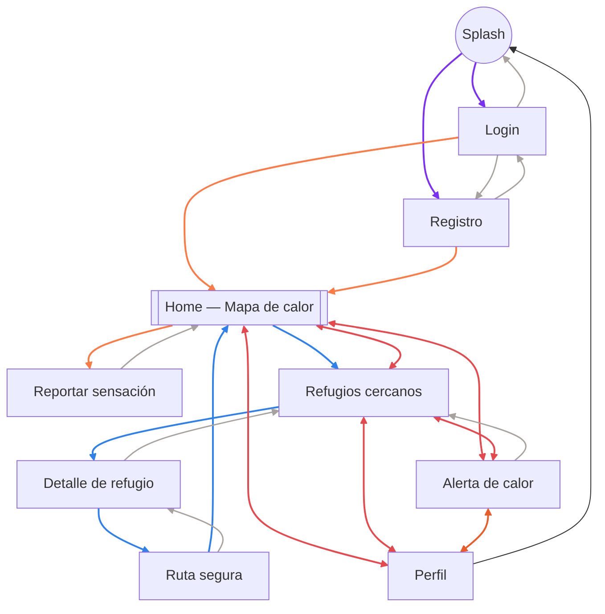