# Universidad Nacional de Ingeniería
### Facultad de Ciencias

**Curso:** Interacción Humano Computadora
**Docente:** Ciro Núñez Iturri
**2026-1**

---

## Lección 2: Entendiendo y Conceptualizando el Diseño de Interacciones

Bibliografía base de la lección:
- *Interaction Design: Beyond Human-Computer Interaction* — Sharp, Rogers, Preece (4th Edition)
- *Designing Interactive Systems: A comprehensive guide to HCI, UX and interaction design* — David Benyon (3rd Edition)

---

## Objetivos

- La Usabilidad
- Explicar cómo conceptualizar la interacción.
- Describir qué es un modelo conceptual y cómo empezar a formularlo.
- Discutir el uso de metáforas de interfaz como parte de un modelo conceptual.
- Describir los tipos de interacción básicos para ayudar en el desarrollo de un modelo conceptual.
- Introducir paradigmas, visiones, teorías, modelos y marcos que ayuden al diseño de interacciones.

---

## Definición de Usabilidad

- **ISO 9241-11**
- Hasta qué punto un producto puede ser usado:
  - Por Usuarios Específicos
  - Para alcanzar objetivos Específicos
  - Con efectividad, eficiencia y satisfacción
  - En un contexto de uso específico

> ISO – 9241-11 Ergonomics of human-system interaction — Part 11: Usability: Definitions and concepts

---

## Atributos de la Usabilidad

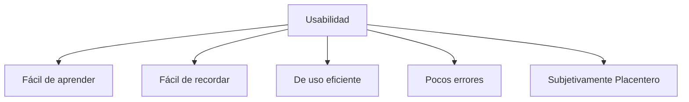

*(Nielsen, 1993, 2010)*

---

## Principios de Usabilidad de Nielsen vs ISO 9241-11

| Principios de Nielsen | ISO 9241-11 |
|---|---|
| Facilidad de aprendizaje | Efectividad |
| Eficiencia en el uso | Eficiencia |
| Fácil de recordar | Satisfacción subjetiva |
| Pocos errores (no catastróficos) | |
| Satisfacción | |

---

## Principios de usabilidad para aplicaciones

- **Efectividad:** Se refiere a la exactitud y el grado de lo completo que logran los usuarios al realizar sus objetivos específicos.
- **Eficiencia:** Se refiere a los recursos utilizados para alcanzar la exactitud y el grado de lo completo que logran los usuarios al realizar sus objetivos específicos.
- **Satisfacción subjetiva:** Se refiere a la ausencia de malestar o incomodidad, y las actitudes positivas hacia el uso del producto.

---

## Atributos del grado de aceptación de un producto (Nielsen)

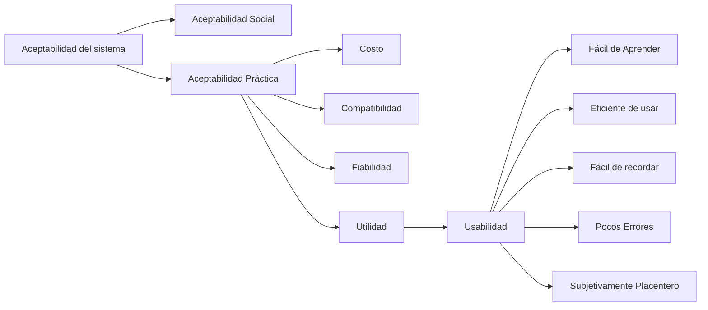

---

## Ejemplo de Análisis de Factores de Usabilidad

Ejemplo aplicado al diseño de un aula virtual, con cuatro dimensiones (Comprensión, Aprendizaje, Eficiencia, Atractividad), cada una evaluada desde tres perspectivas: **arquitectura de la información**, **interfaz de usuario** e **interacción con el usuario**.

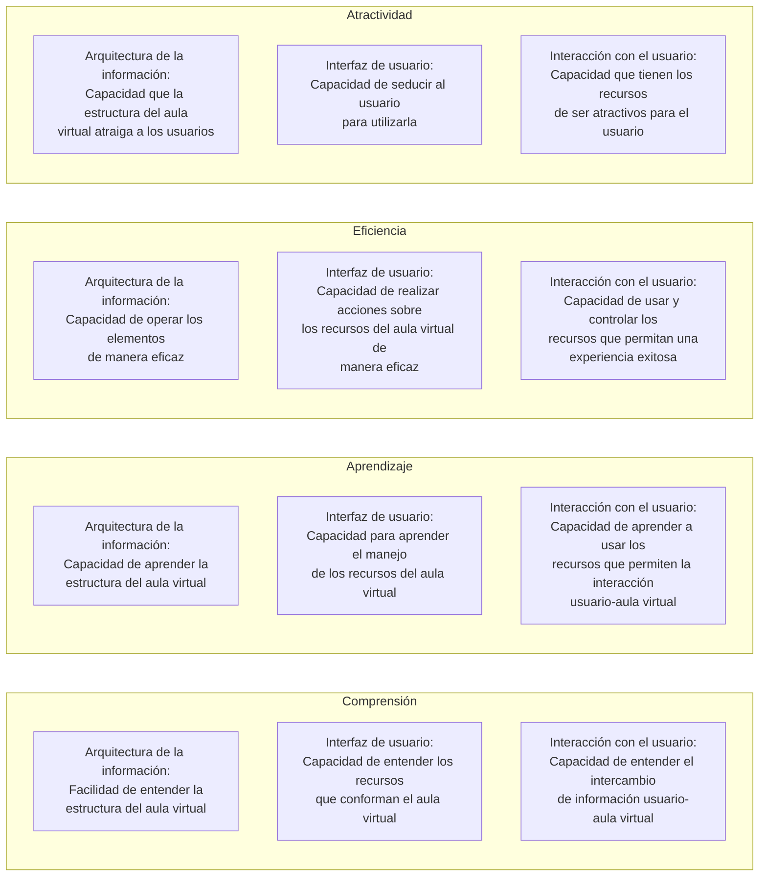

---

## Resumen

- HCI va más allá del diseño de interfases para computadoras de escritorio.
- Tiene que ver con el soporte de todo tipo de actividades humanas en todo tipo de lugares diferentes.
- Tiene que ver con mejorar la experiencia del usuario a través del diseño de interacciones.
- Lograr que el trabajo sea más efectivo, eficiente y seguro para el usuario.
- Mejorar y potenciar el aprendizaje y la formación.
- Proveer entretenimiento agradable y emocionante.
- Mejorar la comunicación y la comprensión.
- Apoyar nuevas formas de expresión y creatividad.

---

## La Conceptualización

- ¿Qué es lo que hará el producto?
- Crear una prueba de concepto
  - ¿Es realista desarrollar todas las sugerencias?
  - ¿Cuán deseable y útil realmente será el producto?
  - ¿Cuáles serán los componentes a diseñar?
- Permite clarificar cómo los usuarios entenderán el producto y cómo será su interacción con él.

---

## La Conceptualización — Principios

**Consistencia:** Elementos de diseño uniformes y predecibles en toda la interfaz (diseño, tipografía, paleta de colores). Ayuda a desarrollar un modelo mental del producto — predecir cómo se comportará en diferentes situaciones.

**Previsibilidad:** Capacidad de los usuarios para anticipar el resultado de sus acciones. Usar patrones y convenciones de diseño familiares para el usuario.

**Asequibilidad:** Capacidad de los elementos de diseño para sugerir su función o propósito (usar metáforas).

**Mapeo:** Relación entre el aspecto de los elementos de diseño y su función. El mapeo debe ser intuitivo y consistente en toda la interfaz.

**Retroalimentación:** La respuesta del sistema a las acciones del usuario. Puede ser visual, auditiva, táctil, etc. Debe proporcionar información clara y significativa.

**Simplicidad:** La claridad y el minimalismo en el diseño. Ayuda a los usuarios a concentrarse y evitar distracciones innecesarias. También ayuda a procesar la información de manera eficiente y reducir la carga cognitiva.

---

## Beneficios de la conceptualización

- **Orientación**
  - Permite a los equipos de diseño hacerse las preguntas necesarias acerca de cómo el modelo conceptual será comprendido por los usuarios finales.
- **Abrirse a las posibilidades**
  - Permite explorar un gran número de ideas para resolver los problemas o necesidades identificados.
- **Desarrollar una base común de entendimiento**
  - Se establecen conceptos y términos comunes con los que todos están de acuerdo. Se reducen las probabilidades de malos entendidos.

---

## Modelo Conceptual — Componentes

- **Metáforas y analogías:** entender para qué se utiliza un producto y cómo usarlo para una actividad (por ejemplo, navegar y marcar).
- **Los conceptos a los que las personas estarán expuestas:** los objetos que crearán y manipularán, los atributos y las operaciones que se pueden realizar con los objetos (como guardar, revisar y organizar).
- **Las relaciones entre los conceptos** (por ejemplo, si un objeto contiene otro).
- **La correspondencia entre los conceptos y la experiencia del usuario.**

La forma en que se organizan las diversas metáforas, conceptos y sus relaciones determina la experiencia del usuario.

---

## Entendiendo el entorno del problema

- ¿Qué es lo que desea crear?
- ¿Cuáles son sus suposiciones?
- ¿Alcanzará el objetivo que usted espera?

---

## ¿Qué es una suposición?

Dar algo por sentado cuando se necesita mayor investigación.

*p.ej. la gente querrá ver la televisión mientras conduce*

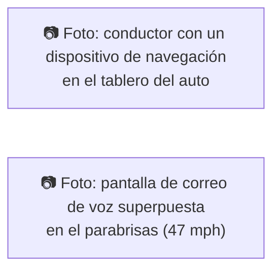

---

## ¿Qué es una pretención (claim)?

Afirmar que algo es cierto cuando todavía está abierto a cuestionamiento.

*p.ej.: "Un estilo de interacción multimodal para controlar el GPS, uno que implica hablar mientras se conduce, es seguro."*

---

## Un framework para analizar el entorno del problema

- ¿Hay problemas con un producto existente o con la experiencia del usuario? Si es así, ¿cuáles son?
- ¿Por qué cree que hay problemas?
- ¿Cómo piensa que sus ideas de diseño propuestas podrían superar estos problemas?
- Si está diseñando para una nueva experiencia de usuario, ¿cómo cree que sus ideas de diseño propuestas apoyan, cambian o amplían las formas actuales de hacer las cosas?

---

## Actividad

Cuáles son las suposiciones y las pretenciones hechas acerca de la TV en 3D?

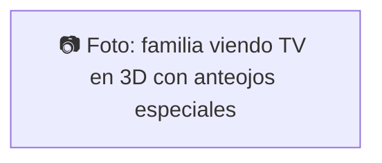

---

## Suposiciones: ¿Son realistas o son una lista de deseos?

- A la gente no le importaría usar las gafas que se necesitan para ver en 3D en sus salas de estar: **razonable**
- A la gente no le importaría pagar mucho más por una nueva pantalla de TV habilitada para 3D: **no es razonable**
- La gente realmente disfrutaría de la claridad mejorada y los detalles de color proporcionados por 3D: **razonable**
- Las personas estarán felices de llevar sus propios anteojos especiales: **razonable solo para un grupo muy selecto de usuarios**

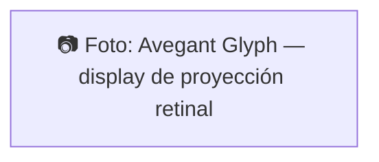
> https://www.youtube.com/watch?v=Q53RtnJpouA

---

## PACT: Personas, Actividades, Contexto, Tecnología

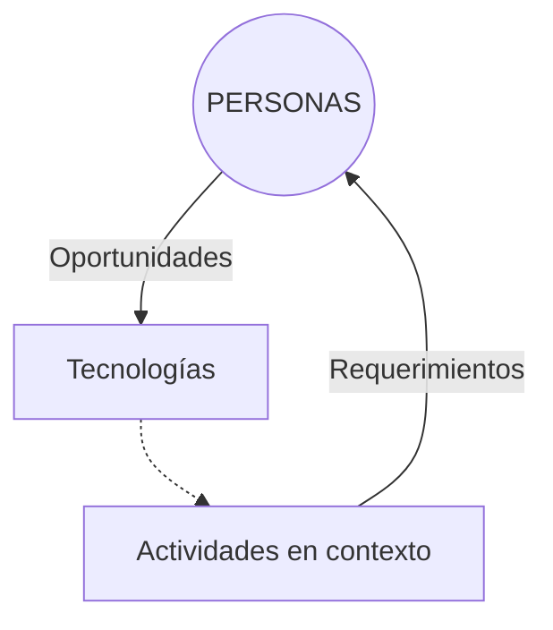

---

## Del entorno del problema al entorno de diseño

Tener una buena comprensión del espacio del problema puede ayudar al espacio de diseño.

*p.ej. qué tipo de interfaz, comportamiento, funcionalidad proporcionar*

Pero antes de decidir sobre estos es importante desarrollar un modelo conceptual.

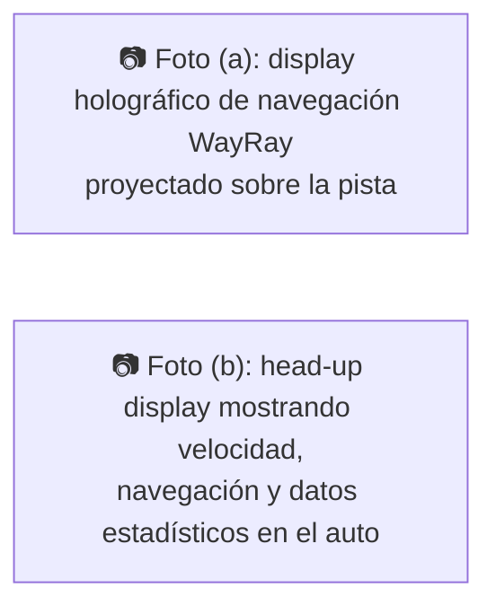

Un ejemplo de display de navegación holográfico de WayRay, que proyecta instrucciones de navegación sobre la pista, a la vez que recolecta y muestra datos estadísticos.

### Pasos:
1. Entender el problema
2. Definir el área a resolver
3. Elegir qué tecnología emplear y decidir cómo diseñar los aspectos físicos del producto

Comprender cuál es actualmente la experiencia del usuario o el producto, por qué es necesario un cambio y cómo mejorará este cambio la experiencia del usuario.

En el ejemplo anterior, esto implica descubrir cuál es el problema que existe con el soporte para navegar mientras se conduce: asegurarse de que los conductores puedan continuar conduciendo de forma segura sin distraerse al mirar una pequeña pantalla de una aplicación de navegación.

---

## Primeros pasos en la formulación de un modelo conceptual

- ¿Qué estarán haciendo los usuarios al realizar sus objetivos?
- ¿Cómo ayudará el sistema a estos objetivos?
- ¿Qué tipo de metáfora de interfaz, si se necesitara alguna, será la apropiada?
- ¿Qué tipos o modos de interacción utilizar?

> Siempre tenga en cuenta al tomar decisiones de diseño: ¿cómo el usuario entenderá el modelo conceptual subyacente?

---

## Modelos Conceptuales

- Los describimos en términos de las actividades y objetos principales.
- También en términos de metáforas de interfaz.
- Crear una prueba de concepto: ¿el producto es viable?, ¿es útil?
- Clarificar la experiencia de usuario: ¿cómo los usuarios comprenderán, aprenderán e interactuarán con el producto?

---

## Metáforas de Interfaces

**Conceptualizar:** un robot con interface de voz para atender clientes en un restaurante.

**Preguntas a resolver:** ¿Qué tan inteligente tiene que ser?; ¿cómo tendría que moverse para parecer que está hablando?; ¿qué pensarían los clientes de él?; ¿pensarían que es demasiado sofisticado y se cansarían fácilmente de él?; ¿o sería siempre interesante para ellos interactuar con el robot, sin saber qué diría en cada nueva visita al restaurante?; ¿podría estar diseñado para ser extrovertido o gruñón o un camarero divertido?; ¿cuáles son las limitaciones de este enfoque asistido por voz?

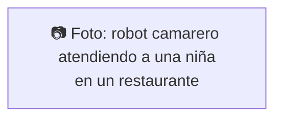

Hacer preguntas, reconsiderar las suposiciones hechas, articular las preocupaciones y los diferentes puntos de vista, son aspectos centrales del proceso de ideación temprana de la conceptualización.

Expresar ideas como un conjunto de conceptos ayuda enormemente a transformar ilusiones en modelos más concretos.

> https://www.frontiersin.org/journals/psychology/articles/10.3389/fpsyg.2020.00198/full

---

## Metáforas Materiales

Muchas de las aplicaciones de redes sociales, como Facebook, Twitter y Pinterest, presentan su contenido en tarjetas.

Las tarjetas tienen una forma familiar, habiendo existido durante mucho tiempo, p.ej. los naipes, tarjetas de visita, tarjetas de cumpleaños, tarjetas de crédito y tarjetas postales.

Proporcionan una forma intuitiva de organizar contenido limitado que es del "tamaño de una tarjeta".

Se pueden hojear, ordenar y tematizar fácilmente. Estructuran el contenido en partes significativas, similar a cómo se usan los párrafos para dividir un conjunto de oraciones relacionadas en distintas secciones.

- Las tarjetas son un elemento muy popular de las Interfases de Usuario.
- ¿Por qué? Tiene un factor de forma familiar.
- Se agregan propiedades materiales, dando apariencia y comportamiento físico, p. ej. superficie de papel.

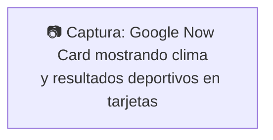
> Figure 2.5 Google Now Card — Source: Google, used with permission.

---

## Metáforas de Interfaces (continuación)

- Un modelo conceptual instanciado en la interfaz, p. ej. la metáfora del escritorio.
- Visualización de una operación, p. ej. un ícono de un carrito de compras para colocar artículos en él.

---

## Actividad

Describir los componentes del modelo conceptual que caracteriza la mayoría de los sitios web de compras, p.ej.

---

## Metáforas de Interfaces (continuación)

- Interfaz diseñada para ser similar a una entidad física pero también tiene propiedades propias.
  - p.ej. metáfora de escritorio, portales web
- Puede basarse en una actividad, un objeto o una combinación de ambos.
- Aprovechar el conocimiento familiar del usuario, ayudándolo a comprender "lo desconocido".
- Evoca la esencia de la actividad desconocida, lo que permite a los usuarios aprovechar esto para comprender más aspectos de la funcionalidad desconocida.

---

## Beneficios de las metáforas de interfaces

- Facilita el aprendizaje de nuevos sistemas.
- Ayuda a los usuarios a comprender el modelo conceptual subyacente.
- Puede ser muy innovador y permitir que el ámbito de las computadoras y sus aplicaciones sea más accesible a una mayor diversidad de usuarios.

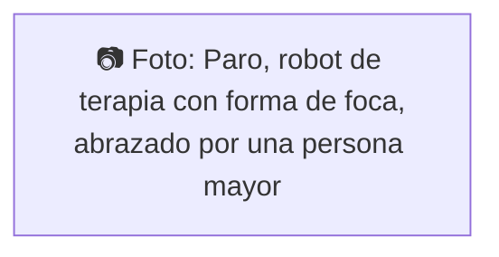
> Paro, la foca robótica, es un nuevo tipo de terapia animal. Diseñado para reducir la ansiedad, la depresión y la soledad, al mismo tiempo que estimula e interactúa con personas que viven con demencia.
> https://www.youtube.com/watch?v=PAJ2GXzaJtQ

---

## Problemas con las metáforas de interfaces

- Rompe las reglas convencionales y culturales
  - p.ej. Una papelera de reciclaje colocada en el escritorio
- Puede limitar a los diseñadores en la forma en que conceptualizan el espacio del problema.
- Puede entrar en conflicto con algunos principios de diseño.
- Obliga a los usuarios a entender el sistema solo en términos de la metáfora.
- Los diseñadores pueden usar sin darse cuenta diseños defectuosos existentes y transferir las partes defectuosas.
- Limita la imaginación de los diseñadores a la hora de idear nuevos modelos conceptuales.

---

## Tipos de Interacción

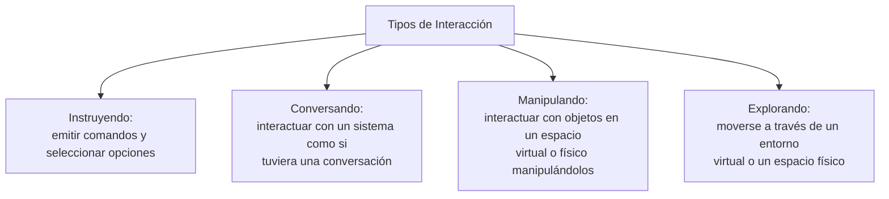

---

## 1. Interacción: Instruyendo

- Donde los usuarios instruyen a un sistema y le dicen qué hacer.
  - p.ej. decir la hora, imprimir un archivo, guardar un archivo.
- Es un Modelo conceptual muy común, subyacente a una diversidad de dispositivos y sistemas.
  - p.ej procesadores de texto, máquinas expendedoras.
- El principal beneficio es que la instrucción permite una interacción rápida y eficiente.
  - bueno para tipos repetitivos de acciones realizadas en múltiples objetos.

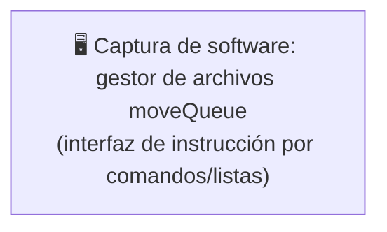

---

## 2. Interacción: Conversando

- Modelo subyacente de tener una conversación con otro ser humano.
- Varía desde simples sistemas controlados por menús de reconocimiento de voz hasta diálogos de "lenguaje natural" más complejos.
- Los ejemplos incluyen horarios, motores de búsqueda, sistemas de asesoramiento, sistemas de ayuda.
- También agentes virtuales, juguetes y robots mascotas diseñados para conversar con las personas.

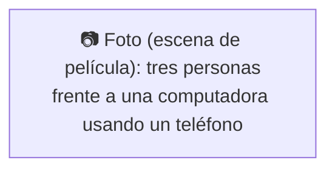

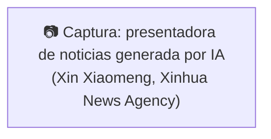
> China's Xinhua News Agency unveiled su latest effort to deliver content via artificial intelligence, introduciendo a Xin Xiaomeng, la primera presentadora de noticias con IA de género femenino de la Agencia.
> https://www.youtube.com/watch?v=5iZuffHPDAw

---

## Pros y contras del modelo conversacional

- Permite a los usuarios, especialmente a los novatos y tecnófobos, interactuar con el sistema de una manera familiar.
  - Los hace sentir más cómodos, a gusto y menos asustados.
- Pueden surgir malentendidos cuando el sistema no sabe cómo analizar lo que dice el usuario.

---

## 3. Interacción: Manipulando

- Implica acciones de arrastrar, seleccionar, abrir, cerrar y hacer zoom en objetos virtuales.
- Explotar el conocimiento de los usuarios sobre cómo se mueven y manipulan en el mundo físico.
- Puede implicar acciones usando controladores físicos (p. ej., Wii) o gestos aéreos (p. ej., Kinect) para controlar los movimientos de un avatar en pantalla.
- Los objetos físicos etiquetados (por ejemplo, pelotas) que se manipulan en un mundo físico dan como resultado eventos físicos/digitales (por ejemplo, animación).

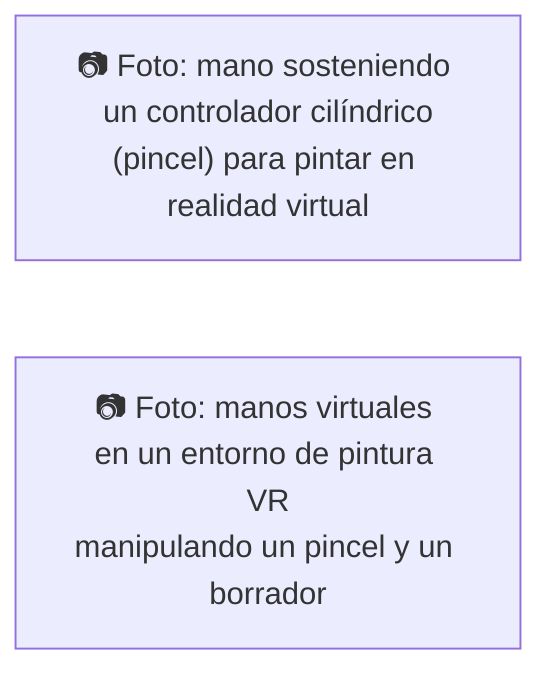
> https://www.youtube.com/watch?v=gqcfzWPy3gk

---

## Manipulación Directa (DM)

- Shneiderman (1983) acuñó el término DM, debido a su fascinación por los juegos de computadora en ese momento.
- Representación continua de objetos y acciones de interés.
- Acciones físicas y presionar botones en lugar de emitir comandos con sintaxis compleja.
- Acciones reversibles rápidas con retroalimentación inmediata sobre el objeto de interés.

---

## ¿Por qué son los interfaces de DM tan atractivos?

- Los principiantes pueden aprender la funcionalidad básica rápidamente.
- Los usuarios experimentados pueden trabajar extremadamente rápido para llevar a cabo una amplia gama de tareas, incluso definiendo nuevas funciones.
- Los usuarios intermitentes pueden conservar los conceptos operativos a lo largo del tiempo.
- Los mensajes de error rara vez son necesarios.
- Los usuarios pueden ver de inmediato si sus acciones están logrando sus objetivos y, si no, pueden hacer otra cosa.
- Los usuarios experimentan menos ansiedad.
- Los usuarios ganan confianza y dominio y sienten que tienen el control.

---

## ¿Cuáles son las desventajas con DM?

- Algunas personas toman la metáfora de la manipulación directa demasiado literalmente.
- No todas las tareas se pueden describir mediante objetos y no todas las acciones se pueden realizar directamente.
- Algunas tareas se logran mejor delegando, p.ej. la corrección ortográfica.
- Pueden convertirse en "devoradores" del espacio de la pantalla.
- Mover el mouse por la pantalla puede ser más lento que presionar las teclas de función para realizar las mismas acciones.

---

## 4. Interacción: Explorando

- Implica que los usuarios se muevan a través de entornos virtuales o físicos.
- Entornos físicos con tecnologías de sensores integrados.

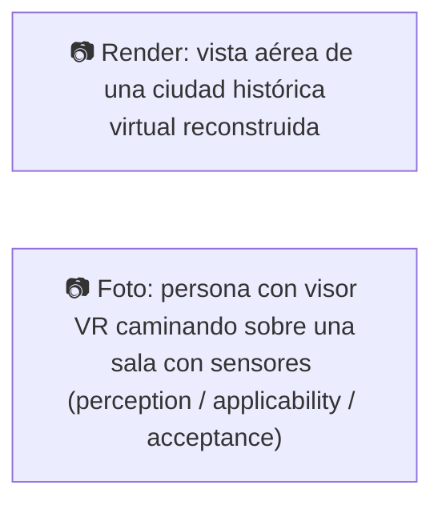

---

## ¿Cuál es el mejor modelo conceptual?

- La manipulación directa es buena para tipos de tareas donde se "hace algo", p. diseñar, dibujar, volar, conducir, dimensionar ventanas.
- Dar instrucciones es bueno para tareas repetitivas, p. corrector ortográfico, gestión de archivos.
- Tener una conversación es bueno para niños, usuarios con fobia a la computadora, usuarios discapacitados y aplicaciones especializadas (por ejemplo, servicios telefónicos).
- A menudo se emplean modelos conceptuales híbridos, en los que se admiten diferentes formas de llevar a cabo las mismas acciones en la interfaz, pero puede llevar más tiempo aprenderlas.

---

## Modelos Conceptuales (síntesis)

- Una estrategia y un marco de trabajo que involucra conceptos generales y sus relaciones.
- Incluye las metáforas y analogías.
- Los conceptos a los que están expuestos las personas a través del producto, incluyendo el dominio de las tareas a realizarse.
- Las relaciones entre esos conceptos.

*La forma en que se organizan las diversas metáforas, conceptos y sus relaciones determina la experiencia del usuario.*

---

## Modelos Conceptuales: interacción e interface

- **Tipo de Interacción:** lo que hace el usuario cuando interactúa con un sistema, p. ej. instruir, hablar, navegar, manipular etc.
- **Tipo de interface:** el tipo de interfaz utilizada para el tipo de interacción, p.ej. voz, basado en menús, gestos.

---

## Existen muchos tipos de interfaces incluyendo…

- Command (instrucciones)
- Speech (voz)
- Data-entry (Ingreso de datos)
- Form fill-in (Llenado de formularios)
- Query (Consultas)
- Graphical (Gráficos)
- Web
- Pen (Lápices electrónicos)
- Augmented reality (Realidad Aumentada)
- Gesture (Gestos)

---

## ¿Qué tipo de interacción escoger?

- Es necesario determinar los requisitos y requerimientos de los usuarios.
- Tener en cuenta el presupuesto y otras restricciones.
- También dependerá de la idoneidad de la tecnología para la actividad a realizarse.

---

## Paradigma

- Representa una fuente de inspiración para un modelo conceptual.
- Es un Enfoque general adoptado por una comunidad para realizar investigaciones.
  - Suposiciones, conceptos, valores y prácticas compartidos.
  - Ej. desktop, ubiquitous computing, Dispositivos Usables, VR, Adaptive Hypermedia.

---

## Ejemplos de Nuevos Paradigmas

- Ubiquitous / Pervasive computing
- Wearable computing
- Tangible bits, augmented reality
- Attentive environments
- Transparent computing

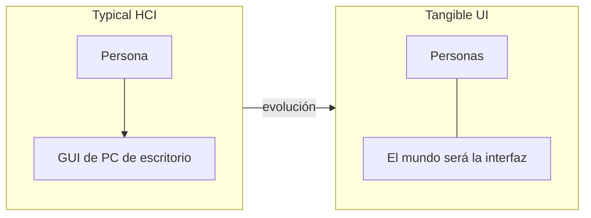

> "La computación transparente es una característica de la computación pervasiva, el posible estado futuro en el que estaremos rodeados de computadoras en todo el entorno que respondan a nuestras necesidades sin nuestro uso consciente. En este contexto, transparente significa invisible."

---

## Ejemplos de Nuevos Paradigmas — El ciclo de diseño centrado en el humano con IA

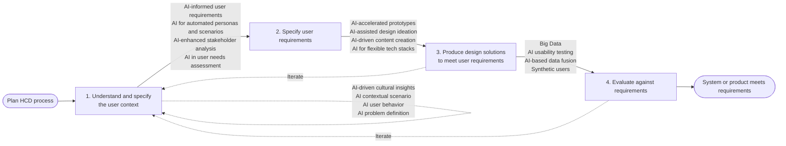
> Figure 2. The human-centered design cycle according to ISO 9241-210:2019, with suggestions on how AI may be used in different steps.

---

## Ejemplos de Nuevos Paradigmas — Colaboración Humano-IA

- **Mezcla Conceptual Interactiva** (Ej. Misty): permite a los desarrolladores tomar elementos (como el layout o el color) de diferentes ejemplos de diseño (capturas de pantalla, bocetos) y "mezclarlos" para crear nuevas interfaces de forma rápida, emulando un proceso cognitivo humano. (https://ar5iv.labs.arxiv.org/html/2409.13900#1)
- **Generación de Interfaz por Intención** (Ej. Frontend Diffusion): el usuario describe su intención o tarea (ej. "quiero planear un viaje") y el sistema (usando IA) genera una interfaz de usuario completa y funcional a partir de esa descripción. (https://ar5iv.labs.arxiv.org/html/2408.00778#1)
- **Colaboración Humano-IA** (Ej. DuetUI): propone un modelo donde la interfaz no es un producto final, sino un "andamio dinámico" para un diálogo continuo entre el usuario y la IA. El usuario y la IA colaboran para descomponer tareas complejas y construir la interfaz paso a paso. (https://dl.acm.org/doi/full/10.1145/3772318.3790441#2)

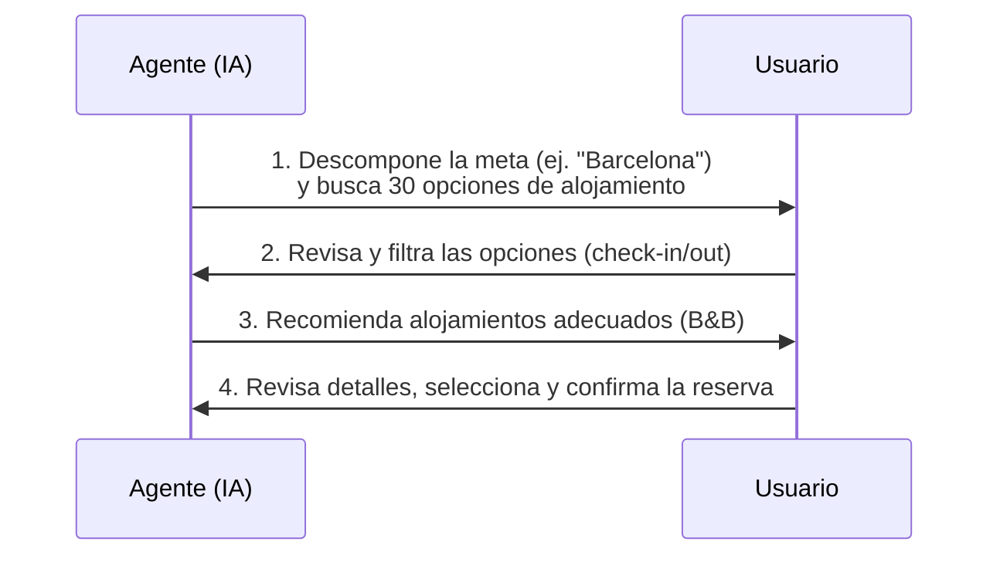
> Figure 1: Ilustración del paradigma de co-generación humano-agente. El bucle de contexto bidireccional muestra cómo agentes y humanos dirigen mutuamente la tarea: el agente descompone una meta de alto nivel en un andamiaje de interfaz concreto, mientras que las manipulaciones directas del usuario sobre esa interfaz proporcionan contexto implícito que guía el siguiente paso del agente.

---

## Ejemplos de Nuevos Paradigmas — Inteligencia Artificial Interactiva Centrada en el Ser Humano

**Definición:** Es una inteligencia artificial que permite la exploración interactiva y la manipulación en tiempo real y está diseñada con el propósito claro de ser de beneficio para el ser humano, mientras es transparente sobre quién tiene el control sobre los datos y los algoritmos.

1. Las personas pueden interactuar en tiempo real con los algoritmos, modelos y datos y pueden manipular y controlar todos los parámetros relevantes.
2. Se puede observar el impacto de los cambios y manipulaciones realizadas por el usuario en tiempo real.
3. En procesos rápidos se puede reducir la velocidad para permitir interacciones, las intervenciones y manipulación.
4. Las personas pueden explorar de forma interactiva por qué y cómo se toman decisiones específicas. Y descubrir cómo los cambios en los parámetros, datos y modelos impactan los resultados.
5. Establece cómo los humanos pueden beneficiarse de la inteligencia artificial.
6. Explica qué riesgos plantea la inteligencia artificial tanto para los individuos como para la sociedad.
7. Es visible quién tiene el control de la inteligencia artificial, en particular quién tiene el poder sobre datos, modelos y algoritmos.
8. Es visible qué datos, bases de conocimientos e información se usa o ha sido utilizada para crear e informar la inteligencia artificial.

> https://dl.acm.org/doi/10.1145/3399715.3400873
> https://www.youtube.com/watch?v=JMLsHI8aV0g

---

## Resumen

- El desarrollo de un modelo conceptual implica una buena comprensión del espacio del problema, especificando qué es lo que está ud. haciendo, por qué y cómo ayudará a los usuarios.
- Un modelo conceptual es una descripción de alto nivel de un producto en términos de lo que los usuarios pueden hacer con él y los conceptos que necesitan para comprender cómo interactuar con él.
- Los tipos de interacción (por ejemplo, conversar, dar instrucciones) proporcionan una forma de pensar sobre la mejor manera de apoyar las actividades del usuario.
- La inteligencia artificial ha llegado a ser un componente de los sistemas con los que interactúan las personas. Se vislumbra el desarrollo de la Inteligencia artificial Interactiva, centrada en el Ser Humano.

---

## Actividad

Ver detalles en el archivo de la tarea propuesto.

---

## Referencias

- Helen Sharp, Yvonne Rogers, Jenny Preece. *Interaction Design: Beyond Human-Computer Interaction*. John Wiley & Sons, 2015.
- David Benyon, *Designing Interactive Systems*, Pearson, 2014. Chapter 2. PACT.
- Nielsen, J. Ch. 1. What is usability? In C. Wilson, C. Courage and K. Baxter, eds., *User Experience Re-Mastered*. Morgan Kaufman, 2010.
- Tom Brinck, Darren Gergle, and Scott D. Wood. User needs analysis. In *User Experience Re-Mastered*. Morgan Kaufman, 2010, Chapter 2.
- Norman, Donald A. (2002). *The Design of Everyday Things*. New York: Basic Books.
- Interactive Human Centered Artificial Intelligence: A Definition and Research Challenges. Albrecht Schmidt, Ludwig-Maximilians. https://uni.ubicomp.net/as/iHCAI2020.pdf
