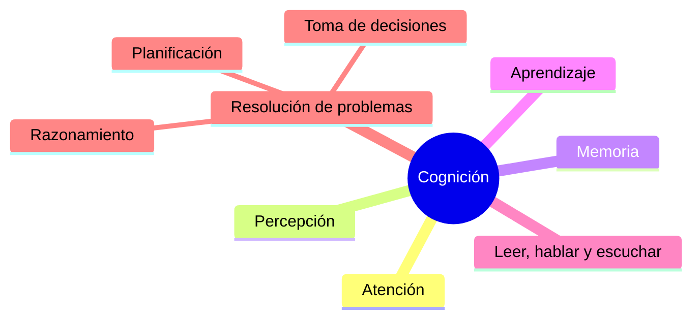
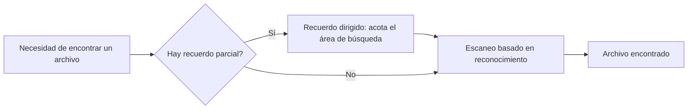
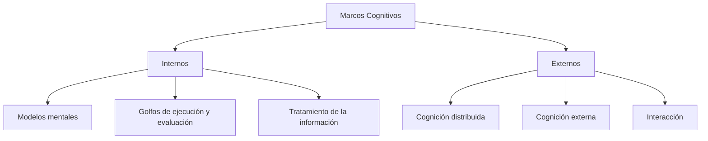
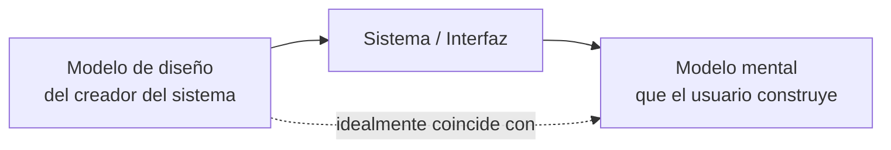
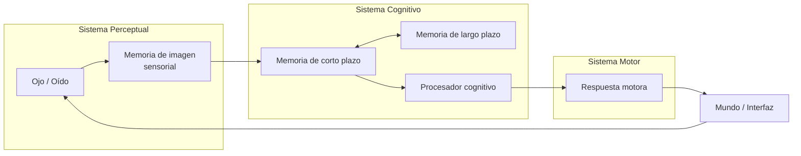
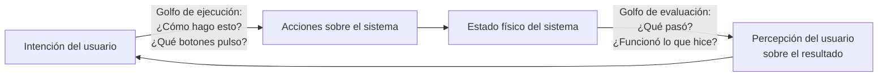
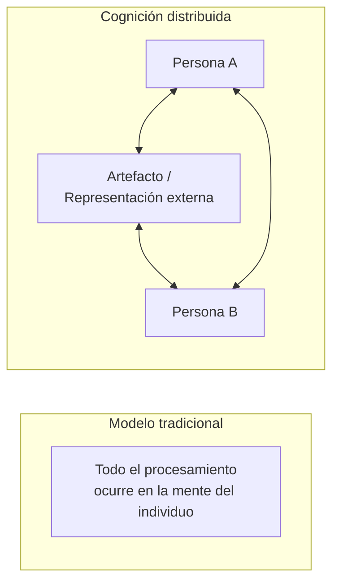

# Lección 3: Aspectos Cognitivos

**Curso:** Interacción Humano Computadora (C451)
**Docente:** Ciro Núñez Iturri — 2026

## Agenda

- ¿Qué es la cognición?
- ¿En qué cosas los usuarios son buenos y en qué son malos?
- ¿Cómo la cognición se ha aplicado al diseño de interacciones?
- ¿Qué son los modelos mentales?
- Algunas teorías de la cognición

## Cognición

**¿Qué es la cognición?**

Hay muchos tipos diferentes de cognición: pensar, recordar, aprender, soñar despierto, tomar decisiones, ver, leer, escribir y hablar.

> La cognición es "la acción o proceso mental de adquirir conocimiento y comprensión a través del pensamiento, la experiencia y los sentidos".

La cognición (del latín *cognoscere*, 'conocer') es la facultad de un ser vivo para procesar información a partir de la percepción, el conocimiento adquirido (experiencia) y características subjetivas que permiten valorar la información.

- Incluye procesos: aprendizaje, razonamiento, atención, memoria, resolución de problemas, toma de decisiones, sentimientos.
- Se aplica también a entidades artificiales, conscientes o inconscientes.
- Perspectivas de estudio: neurología, psicología, psicoanálisis, sociología, filosofía, antropología (cultural, filosófica, médica), y ciencias de la información (IA, gestión del conocimiento, aprendizaje automático).

*(Fuente: Wikipedia)*

### ¿Por qué necesitamos entender a los usuarios?

Interactuar con la tecnología es un proceso cognitivo:

- Surge la necesidad de tener en cuenta los procesos y limitaciones cognitivas de los usuarios.
- Proporciona conocimiento sobre lo que se puede y no se puede esperar que hagan los usuarios.
- Identifica y explica la naturaleza y causas de los problemas que encuentran los usuarios.
- Suministra teorías, herramientas de modelado, orientación y métodos que conducen a mejores productos interactivos.

## Procesos cognitivos

### Atención

- Habilidad de seleccionar en qué concentrarse, en un punto en el tiempo, de la masa de estímulos que nos rodea.
- Permite centrarnos en la información relevante para lo que estamos haciendo.
- Involucra los sentidos auditivo y/o visual.
- La atención enfocada y dividida permite ser selectivos frente a estímulos que compiten, pero limita la capacidad de seguir todos los eventos.
- La información en la interfaz debe estructurarse para captar la atención: límites perceptuales (ventanas), color, video inverso, sonido, luces intermitentes.

**Actividad (Tullis, 1987):** dos pantallas con la misma densidad de información (31%) produjeron tiempos de búsqueda distintos: 5.5 s vs. 3.2 s. La causa fue el **espaciado**: en la primera pantalla la información estaba agrupada (dificulta la búsqueda); en la segunda se ordenó en categorías verticales (facilita la búsqueda).

**Multitasking y atención (Ophir et al., 2009):** compararon personas con multitarea intensiva vs. ligera.

- Quienes hacen multitarea intensiva son más propensos a distraerse.
- Las personas que realizan múltiples tareas se distraen fácilmente y les cuesta filtrar información irrelevante.

**Diseño para la atención:**

- Hacer que la información resalte cuando se necesita captar atención; lo más importante por encima del promedio.
- Las personas buscan más si: la disposición facilita el escaneo, la información visible sugiere que vale la pena seguir buscando, lo importante está al inicio (y también algo importante al final).
- **Mapas de calor de atención:** prueba de sitios web para saber a qué partes de la página prestan más atención los usuarios; útiles para optimizar contenido de calidad y decidir qué resaltar (incluido contenido bajo scroll).

**Principios clave de diseño para la atención:**

1. **Límites perceptuales:** ventanas modales o tarjetas para aislar información (ej. formulario de registro en Google Docs oscurece el fondo). Ver leyes de la Gestalt aplicadas a UI.
2. **Color y contraste:** ej. rojo para errores, verde para acciones exitosas; botón "Enviar" azul destacado vs. gris deshabilitado. Ver guía de color en Material Design.
3. **Estímulos dinámicos:** animaciones suaves (carga progresiva) o parpadeos breves para alertas críticas (ej. batería baja: icono parpadeante + sonido). Ver Material 3 Expressive.

**Implicaciones de diseño para la atención:**

- Hacer que la información destaque cuando se necesite atención (color, orden, espaciado, subrayado, secuencia, animación).
- Evitar saturar la interfaz con demasiada información.
- Motores de búsqueda y formularios con interfaces simples y limpias son más fáciles de usar.
- Ver [Ley de Hick](https://lawsofux.com/hicks-law/).

### Percepción

Cómo se adquiere información del mundo y se transforma en experiencias. Implicación de diseño: representaciones fácilmente perceptibles (texto legible, íconos fáciles de distinguir).

**Actividad — Weller (2004):** las personas tardan menos en localizar información agrupada usando un **borde** que usando solo **contraste de color**.

**Principios de Gestalt (lineamientos de percepción):**

- **Proximidad:** objetos cercanos en espacio o tiempo tienden a percibirse como "juntos". Riesgo: si una etiqueta de campo está más cerca del campo de abajo que del suyo, el usuario cree erróneamente que ahí va la información.
- **Similitud:** objetos agrupados por similitud facilitan la percepción de orden y la búsqueda de información (ej. archivos organizados vs. desorganizados; un mismo ícono junto a elementos funcionalmente similares).
- **Continuidad:** tendemos a percibir patrones continuos y suaves más que interrumpidos. La mente sigue caminos y agrupa elementos alineados; se pueden usar líneas para guiar al usuario hacia elementos importantes.
- **Cierre:** ante una disposición compleja, primero buscamos un patrón único y reconocible; permite completar mentalmente una imagen a la que le faltan partes.
- (Mencionados también: Parte-Todo, Simplicidad, Simetría, Paralelismo.)

Ver: *The 7 Gestalt web design principles*.

**Implicaciones de diseño de percepción:**

- Los íconos deben permitir distinguir fácilmente su significado.
- Bordear y espaciar son formas visuales efectivas de agrupar información.
- Los sonidos deben ser audibles y distinguibles.
- La salida de voz debe permitir distinguir entre palabras habladas.
- El texto debe ser legible y distinguible del fondo.
- La retroalimentación táctil debe permitir reconocer y distinguir significados distintos.

### Memoria

- Implica primero **codificar** y luego **recuperar** el conocimiento.
- Las personas no pueden recordar todo: implica filtrar y procesar lo atendido.
- El contexto es importante y afecta la memoria (dónde y cuándo).
- Somos mucho mejores para **reconocer** que para **recordar**.
- Recordamos menos los objetos que hemos fotografiado que los que observamos directamente (Henkel, 2014).

**El contexto importa:** codificar información en un contexto y recuperarla en otro dificulta el reconocimiento (ej. reconocer a un vecino fuera del contexto habitual del edificio).

**Actividad:** recordar la fecha de cumpleaños de los abuelos vs. el aspecto de la última app descargada — normalmente es más fácil lo visual. Las personas son buenas recordando señales visuales (color, ubicación, marcas) pero les cuesta más el material arbitrario (fechas, números de teléfono).

**El problema del clásico "7 ± 2":**

- Teoría de George Miller (1956) sobre la cantidad de información que las personas pueden recordar en memoria inmediata.
- Muchos diseñadores lo toman como regla de diseño (7 opciones en un menú, 7 íconos en una barra, no más de 7 viñetas, 7 elementos en un dropdown, 7 pestañas), **pero esto es un error**:
  - Es una aplicación inapropiada de la teoría: las personas pueden **escanear** listas de viñetas/pestañas/menús para encontrar lo que buscan; no necesitan memorizarlas.
  - A veces pocos ítems es bueno, pero depende de la tarea y el tamaño de pantalla, no de la regla 7±2.
- Cowan (2002) propuso una revisión: memoria de corto plazo limitada a **4 ± 1** porciones (diálogos particionados).
- **Limitación de tiempo:** los eventos en memoria de corto plazo persisten ~30 segundos; los elementos importantes deben persistir más tiempo en la interfaz.

**Organización de contenido digital:** problema creciente (documentos, imágenes, música, videos, correos, adjuntos, marcadores). Nombrar los elementos es el método más común de codificación, pero es difícil de recordar con miles de ítems.

- Lansdale y Edmonds (1992): la actividad involucra dos procesos de memoria: **recuerdo dirigido** seguido de **escaneo basado en reconocimiento**.
- Los sistemas de contenido digital deben optimizar ambos procesos: usar la memoria disponible para acotar el área de búsqueda y luego representar bien la información en esa área (ej. cuadro de búsqueda + historial de búsquedas).
- Ayudar a codificar archivos de formas más ricas: colores, marcas, imágenes, texto flexible, marcas de tiempo.

**Reconocer vs. recordar:**

- Interfaces basadas en comandos requieren recordar nombres de un conjunto de cientos de opciones.
- Las GUI ofrecen opciones visuales que solo requieren explorar hasta reconocer la deseada.
- Navegadores, historiales de URL, listas de reproducción, etc. usan memoria de reconocimiento.

**Olvidar en forma digital:** a veces se desea olvidar contenido en línea (evocaciones dolorosas por fotos compartidas/redes sociales). Actividad relacionada: cómo disminuir la identidad digital; qué sabe Facebook de sus usuarios.

**Ayudas a la memoria:** SenseCam (Microsoft Research, ahora Autographer) — dispositivo portátil que toma fotos intermitentes sin intervención del usuario; ha mostrado mejorar la memoria en personas con Alzheimer.

**Implicaciones de diseño (memoria):**

- No sobrecargar la memoria de los usuarios con procedimientos complicados.
- Diseñar interfaces que promuevan el **reconocimiento** en lugar del **recuerdo**.
- Proporcionar varias formas de codificar información (categorías, color, marcas de tiempo).

### Aprendizaje

- Cómo aprender a usar una aplicación (manual vs. video, etc.).
- A las personas les resulta difícil aprender siguiendo instrucciones de un manual; **prefieren aprender haciendo**.

**Implicaciones de diseño:**

- Diseñar interfaces que fomenten la exploración.
- Diseñar interfaces que restrinjan y guíen a los alumnos (ver ejemplo: human.biodigital.com).
- La vinculación dinámica de conceptos y representaciones facilita el aprendizaje de material complejo.

### Leer, hablar y escuchar (procesamiento del lenguaje)

- La facilidad para leer, escuchar o hablar difiere entre personas.
- Muchos prefieren escuchar a leer; leer puede ser más rápido que hablar o escuchar; escuchar requiere menos esfuerzo cognitivo que leer o hablar.
- Personas disléxicas tienen dificultad para comprender/reconocer palabras escritas.

**Aplicaciones:**

- Sistemas de reconocimiento de voz (Google Voice, Siri).
- Sistemas de salida de voz (texto a voz para personas invidentes).
- Sistemas de lenguaje natural (preguntar al buscador).

**Implicaciones de diseño:**

- Menús e instrucciones basados en voz deben ser breves.
- Acentuar la entonación de voces sintéticas (más difíciles de entender que voces humanas).
- Brindar opciones para agrandar el texto en pantalla.

### Resolución de problemas, planificación, razonamiento y toma de decisiones

Implica cognición reflexiva: pensar qué hacer, qué opciones y consecuencias hay. A menudo involucra procesos conscientes, discusión con otros (o con uno mismo) y uso de artefactos (mapas, libros, pluma y papel). Puede implicar comparar escenarios y decidir la mejor opción.

**Implicaciones de diseño:**

- Proporcionar información/funciones adicionales para quienes quieran entender mejor cómo realizar una actividad.
- Usar ayudas computacionales simples para apoyar decisiones y planificación rápida en movimiento.

## Marcos cognitivos

Marcos conceptuales y teorías para explicar y predecir el comportamiento del usuario:

### Modelos mentales

Los usuarios desarrollan una comprensión de un sistema aprendiendo sobre él y usándolo. El conocimiento se describe como un modelo mental:

- Cómo utilizar el sistema (qué hacer a continuación).
- Qué hacer con sistemas desconocidos o situaciones inesperadas (cómo funciona el sistema).

Las personas hacen inferencias usando modelos mentales de cómo realizar tareas.

**Craik (1943):** los modelos mentales son construcciones internas de algún aspecto del mundo externo que permiten hacer predicciones.

- Implica procesos conscientes e inconscientes (se activan imágenes y analogías).
- Modelos profundos vs. superficiales (ej. saber conducir un auto vs. saber cómo funciona).

Idealmente, el modelo mental del usuario debería coincidir con el modelo conceptual del sistema.

**Implicaciones de diseño:**

- Retroalimentación útil en respuesta a la entrada del usuario.
- Formas fáciles e intuitivas de interactuar con el sistema.
- Instrucciones claras y fáciles de seguir.
- Tutoriales y ayuda en línea apropiados.
- Orientación sensible al contexto según el nivel de experiencia del usuario.
- Determinar los modelos mentales existentes mediante investigación de usuarios y competidores.
- Usar datos para identificar puntos débiles del usuario.
- Crear mapas de viaje (*journey maps*) y mapas de empatía.
- Usar metáforas de interfaz para aplicar modelos mentales al diseño.
- Crear diseños alineados con los modelos mentales de los usuarios.
- Recordar que los modelos mentales son subjetivos e individuales: evitar asumir que el modelo mental propio es el mismo que el del usuario.

### Modelo del procesador humano (Card et al., 1983)

- Modela los procesos de información de un usuario interactuando con una computadora.
- Predice qué procesos cognitivos están involucrados en la interacción.
- Permite calcular el tiempo que tardará un usuario en realizar una tarea.

**Limitaciones:** se basa en modelar actividades mentales que ocurren exclusivamente "dentro de la cabeza"; no explica adecuadamente cómo las personas interactúan con computadoras y dispositivos en el mundo real.

### Golfos de ejecución y evaluación

- **Golfo de ejecución:** diferencia entre las intenciones del usuario y las acciones que el sistema permite realizar. Representa el esfuerzo para averiguar cómo usar un objeto/interfaz para lograr la meta.
- **Golfo de evaluación:** diferencia entre el estado físico del sistema y la percepción del usuario sobre ese estado. Representa el esfuerzo para interpretar si la acción tuvo éxito.

### Cognición distribuida (Hutchins, 1995)

- Se ocupa de los fenómenos cognitivos entre individuos, artefactos y representaciones internas/externas.
- La información se transforma a través de distintos medios (computadoras, pantallas, papel, cabezas), a diferencia del modelo tradicional (centrado solo en la mente individual).

**Qué está involucrado:**

- La resolución distribuida de problemas.
- El papel de la conducta verbal y no verbal.
- Mecanismos de coordinación (normas, procedimientos).
- La comunicación durante la actividad colaborativa.
- Cómo se comparte y se accede al conocimiento.

### Cognición externa

- Explica cómo interactuamos con representaciones externas (mapas, notas, diagramas).
- Interesa qué beneficios cognitivos aportan, qué procesos implican y cómo amplían nuestra cognición.
- Qué representaciones basadas en computadora se pueden desarrollar para ayudar más.

**Externalizar para reducir la carga sobre la memoria:**

- Diarios, recordatorios, calendarios, notas, listas de compras/tareas, post-its, correos marcados.
- Las representaciones externas recuerdan que hay que hacer algo, qué hacer y cuándo hacerlo (ej. comprar y enviar una tarjeta antes de una fecha).

**Descarga computacional:** una herramienta se usa junto con una representación externa para realizar un cálculo (ej. lápiz y papel).

**Anotación y rastreo cognitivo:**

- **Anotación:** modificar representaciones existentes mediante marcas (tachar, subrayar, marcar).
- **Rastreo cognitivo:** manipulación externa de elementos en distintos órdenes o estructuras (ej. Scrabble, jugar cartas).

**Implicaciones de diseño:** proporcionar representaciones externas en la interfaz que reduzcan la carga de memoria y faciliten la descarga computacional (ej. visualizaciones de información para tomar decisiones rápidas sobre grandes volúmenes de datos).

## Resumen

- La cognición involucra varios procesos: atención, memoria, percepción y aprendizaje.
- El diseño de una interfaz afecta en gran medida qué tan bien los usuarios pueden percibir, atender, aprender y recordar cómo hacer sus tareas.
- Los marcos teóricos (modelos mentales, cognición externa, etc.) ayudan a comprender cómo y por qué las personas interactúan con los productos.
- Esto guía el diseño de mejores productos.

## Referencias

- Helen Sharp, Yvonne Rogers, Jenny Preece. *Interaction Design: Beyond Human-Computer Interaction*. John Wiley & Sons, 2015. Capítulo 3.
- David Benyon, Phil Turner, Susan Turner. *Designing Interactive Systems: People, Activities, Contexts, Technologies*. Addison Wesley, 2014. Capítulos 23, 24.
- Andy Rutledge. *Gestalt principles of perception*, 2008.
